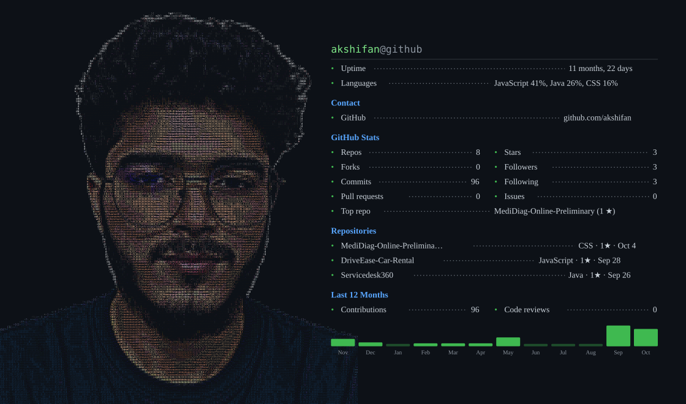

# 💫 About Me:
📡 I’m currently working on<br>Java Spring Boot full-stack applications, REST APIs, PostgreSQL databases, and production-ready web applications.<br>👥 I’m looking to collaborate on<br>Java/Spring Boot projects, full-stack applications, AI-powered platforms, and open-source projects.<br>🤝 I’m looking for help with<br>Advanced backend architecture, cloud deployment, system design, testing, and scalable application development.<br>🌱 I’m currently learning<br>Spring Boot, JPA/Hibernate, React, AWS, microservices, DevOps, system design, and Generative AI.<br>💬 Ask me about<br>Java, Spring Boot, REST APIs, React, PostgreSQL, Git/GitHub, and full-stack web development.<br>⚡ Fun fact<br>I enjoy turning ideas into complete working applications—from database design and backend APIs to frontend interfaces and deployment.


## 🌐 Socials:
[](https://instagram.com/ak.shifan) [](https://linkedin.com/in/ak-shifan) [](mailto:akshifan234@gmail.com) 

# 💻 Tech Stack:
                                          
# 📊 GitHub Stats:
<br/>
<br/>


## 🏆 GitHub Trophies


### ✍️ Random Dev Quote


### 🔝 Top Contributed Repo


---
[](https://visitcount.itsvg.in)

<!-- Proudly created with GPRM ( https://gprm.itsvg.in ) -->




<div align="center">

<table>
<tr>
<td width="52%" align="center" valign="middle">

<br>

<!-- ASCII PORTRAIT -->


<br>

</td>

<td width="58%" valign="middle">

# ABDUL KHADER SHIFAN

### Java Full Stack Developer

**Java · Spring Boot · React · PostgreSQL**

Building modern, scalable and production-ready web applications with a strong focus on backend engineering, REST APIs and clean architecture.

<br>

<a href="https://github.com/akshifan">

</a>

<a href="mailto:akshifan234@gmail.com">

</a>

<br><br>

**Currently focused on**

`Java` `Spring Boot` `React` `PostgreSQL` `REST APIs` `Agentic AI`

<br>

**Open to Java Backend & Full Stack opportunities**

</td>
</tr>
</table>

</div>

---

## ABOUT ME

I'm a **Computer Science Engineering graduate** passionate about building reliable backend systems and modern full-stack applications.

My development approach focuses on:

* Clean and maintainable code
* Scalable backend architecture
* RESTful API design
* Secure authentication and authorization
* Database design and optimization
* Responsive and intuitive frontend experiences

I'm currently strengthening my expertise in **Java, Spring Boot, React, PostgreSQL, cloud technologies and production-ready application development.**

---

## FEATURED PROJECTS

<table>
<tr>

<td width="33%" valign="top">

### 🏥 MediDiag

**AI-Powered Healthcare Platform**

A healthcare platform combining preliminary symptom analysis, doctor discovery and online appointment booking.

**Technology**

`Node.js`  
`Express.js`  
`Python`  
`Flask`  
`PostgreSQL`  
`Machine Learning`

**Highlights**

* AI-assisted symptom analysis
* ML-based preliminary prediction
* Doctor discovery
* Appointment booking
* Patient & doctor portals
* Healthcare assistant

<br>

<a href="https://github.com/akshifan/MediDiag-Online-Preliminary">
View Project →
</a>
<br>
<a href="https://medidiag-qkoo.onrender.com">
View Project on Live →
</a>

</td>

<td width="33%" valign="top">

### 🎫 ServiceDesk360

**IT Service Management Platform**

A multi-tenant service management platform for managing tickets, employees, customers, SLAs and support operations.

**Technology**

`Java`  
`Spring Boot`  
`React`  
`PostgreSQL`  
`JWT`

**Highlights**

* Multi-tenant architecture
* Ticket management
* SLA tracking
* Role-based access
* Priority queues
* Notifications
* Dashboards
* Audit logs

<br>

<a href="https://github.com/akshifan/Servicedesk360">
View Project →
</a>
<br>
<a href="https://servicedesk360-frontend.onrender.com">
View Project on Live →
</a>

</td>

<td width="33%" valign="top">

### 🚗 DriveEase

**Vehicle Rental Platform**

A full-stack vehicle rental platform connecting customers with fleet partners.

**Technology**

`Java`  
`Spring Boot`  
`React`  
`PostgreSQL`  
`JWT`  
`Flyway`

**Highlights**

* Vehicle catalogue
* Online booking
* Fleet management
* Vehicle image galleries
* JWT authentication
* Booking concurrency
* Admin management

<br>

<a href="https://github.com/akshifan/DriveEase-Car-Rental">
View Project →
</a>
<br>
<a href="https://driveease-frontend-su3k.onrender.com">
View Project on Live →
</a>

</td>

</tr>
</table>

---

## TECHNICAL SKILLS

<table>
<tr>

<td width="50%" valign="top">

### Backend Development

`Java`  
`Spring Boot`  
`Spring MVC`  
`REST APIs`  
`JWT Authentication`  
`Node.js`  
`Express.js`

</td>

<td width="50%" valign="top">

### Frontend Development

`React`  
`JavaScript`  
`HTML5`  
`CSS3`  
`Tailwind CSS`  
`Responsive UI`

</td>

</tr>

<tr>

<td width="50%" valign="top">

### Database & Persistence

`PostgreSQL`  
`SQL`  
`JPA / Hibernate`  
`Flyway`  
`Database Design`

</td>

<td width="50%" valign="top">

### Tools & Technologies

`Git`  
`GitHub`  
`IntelliJ IDEA`  
`Maven`  
`AWS`  
`Agile / Scrum`

</td>

</tr>
</table>

---

## DEVELOPMENT FOCUS

<div align="center">

| Backend | Frontend | Database | Cloud |
|:---:|:---:|:---:|:---:|
| ☕ Java | ⚛️ React | 🐘 PostgreSQL | ☁️ AWS |
| 🌱 Spring Boot | 🟨 JavaScript | 🗄️ SQL | 🚀 Deployment |
| 🔐 REST APIs | 🎨 Tailwind CSS | 🔄 Flyway | 📦 Production |

</div>

---

## GITHUB

<div align="center">


</div>

---

## CURRENTLY

```text
Java + Spring Boot
        ↓
REST API Development
        ↓
PostgreSQL + JPA
        ↓
React Frontend
        ↓
Testing + Security
        ↓
AWS / Cloud Deployment
